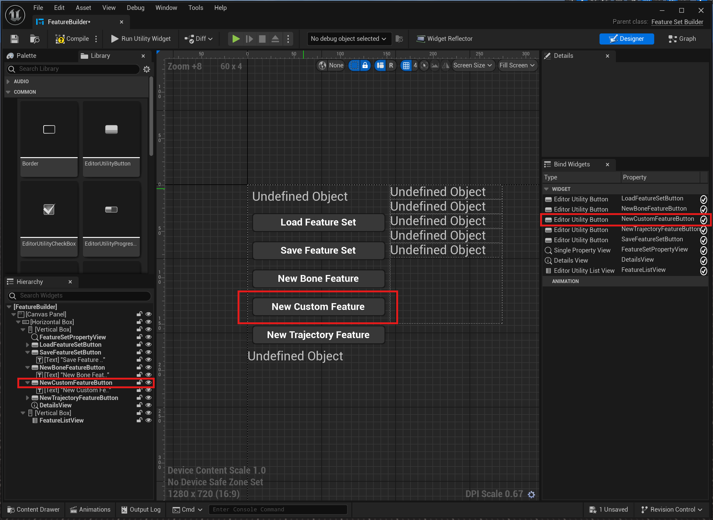

# Neural Animation Toolkit

This project provides a set of tools aiming to make it easier to experiment with running animations from neural network models. By unifying the offline and realtime feature definitions, the toolkit should make it easier to extract the dataset from the engine directly and run the models trained on that dataset in real time through custom animation node.

The project is intended to be the baseline to be extended for your chosen use case. It provides all the template code you need for training and running the model of your choice

The plugin contains the following features

- Feature Data Asset for defining features based on the skeleton and chosen parameters
- Feature Builder Widget for defining the feature vector of your model
- Dataset Extraction Widget for convenient extraction of the animation data straight from the engine
- Sample Animation Node for running the model
- Inertialiser for smoothing inbetween frames

## How it works
### Create Feature Set Data Asset
### Modify Features through Feature Builder Widget
### Extracting the dataset through Dataset Extractor Widget
### Parse the dataset into python
### Run the model in real time

## Creating custom features

The plugin can be extended with additional feature classes to better fit the need of the developer. The new feature should contain all the functionality for outputting feature vector both offline and in real time.

### Define new Feature
The project contains sample features for trajectory and bone information, as seen in Starke and Holden papers on procedural animation. To create a custom feature, simply inherit from the **UFeature** class and override the necessary functions as shown in the **UBoneFeature** and **UTrajectoryFeature** examples. 

```

// Either in youre feature file or just Features.h

UCLASS()
class NEURALANIMATIONTOOLKIT_API UCustomFeature : public UFeature
{
	GENERATED_BODY()

public:

	UCustomFeature() = default;

	// FeatureComputeInterface
	void InitialiseOffline(const FReferenceSkeleton& RefSkeleton) override { *** }
	void InitialiseRealTime(const FBoneContainer& BoneContainer) override 
    { 
        ***
	TArray<float> ComputeRealTime(const FBoneContainer& BoneContainer, FCSPose<FCompactPose> InPose, float DeltaTime) override
	{
		***
	}

	TArray<float> ComputeOffline(const TArray<TArray<FTransform>>& BoneTransforms, float DeltaTime, int FrameIndex) override
	{
		***
	}

	int32 GetFeatureSize() const override
	{
        ***
	}
	// End FeatureComputeInterface
};

```

Each feature should have implemented versions of offline and realtmie computation that return a float array representing a feature vector. The class also exposes the initialisation functions in case of getting an appropriate bone indexes for the bone references or iniialising them in animnode.

### Expose to Feature Builder

The second step is to expose the new feature to the **FeatureBuilder** widget as a button. In **UFeatureBuilder** class, add a new **UEditorUtilityButton** pointer as well as the corresponding *OnNewCustomFeatureButtonClicked* function to register to the new button. 


```
UCLASS(Abstract)
class NEURALANIMATIONTOOLKIT_API UFeatureSetBuilder : public UEditorUtilityWidget
{
	GENERATED_BODY()

public:

    ***

    // Add this
    UPROPERTY(EditAnywhere, meta = (BindWidget))
    TObjectPtr<UEditorUtilityButton> NewCustomFeatureButton;

private:

    ***

    // And this
    UFUNCTION()
    void OnNewCustomFeatureButtonClicked(); // Button to create a new trajectory feature

};
```

In the cpp file, append the NativeConstruct function and then simply copy paste the code from other button function and replace it with your feature class


```
// In FeatureSetBuilder.cpp

void UFeatureSetBuilder::NativeConstruct()
{
	Super::NativeConstruct();

    ***

	if (NewCustomFeatureButton) {
		NewCustomFeatureButton->OnClicked.AddDynamic(this, &UFeatureSetBuilder::OnNewCustomFeatureButtonClicked);
	}

    ***

}

***

void UFeatureSetBuilder::OnNewCustomFeatureButtonClicked()
{
	if (!FeatureSetSchema)
	{
		return;
	}

	UCustomFeature* NewCustomFeature = NewObject<UCustomFeature>(FeatureSetSchema);
	FeatureSetSchema->AddFeature(NewCustomFeature);
	FeatureSetSchema->MarkPackageDirty();
	FeatureSetSchema->PostEditChange();

	LoadFeatureList();

}

```

### Add a Custom Feature Button in UMG
After the button has been defined in the code, the visual side needs to be added. Simply open the FeatureBuilder Widget in UMG and add a corresponding New Custom Feature Button. Make sure the name of the new button matches that of the pointer in the .h file.

